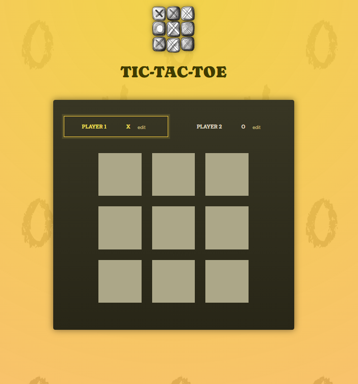
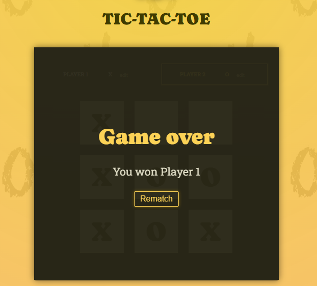
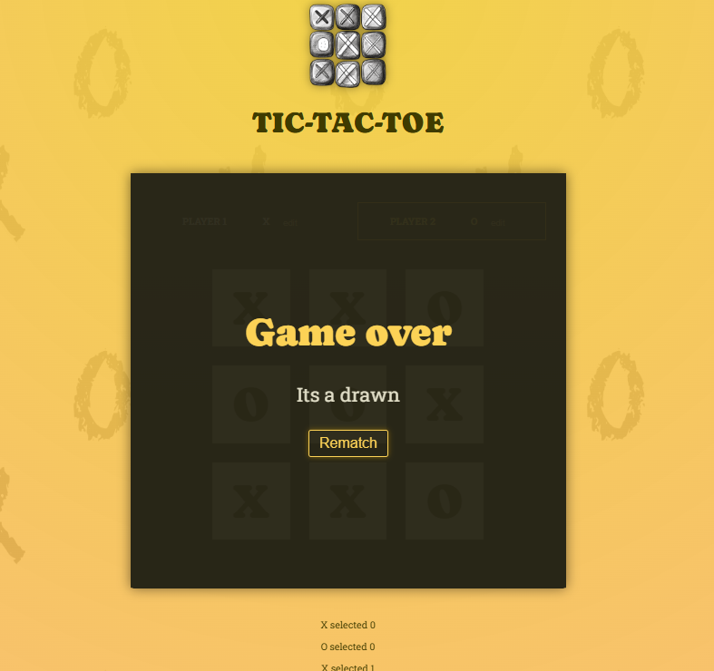

# 🕹️ Tic-Tac-Toe (Jogo da Velha)

Um jogo da velha moderno feito com **React** e **TypeScript**, que permite dois jogadores competirem, personalizarem seus nomes, e verem o histórico de jogadas. Ideal para praticar lógica e hooks do React.

---

## 🚀 Funcionalidades

- ✅ Dois jogadores (X e O)
- ✅ Entrada de nome customizada para os jogadores
- ✅ Verificação de vitória e empate
- ✅ Histórico completo das jogadas (log)
- ✅ Reinício do jogo com um botão

---

## 🛠️ Tecnologias Utilizadas

- [React](https://reactjs.org/) (com hooks)
- [TypeScript](https://www.typescriptlang.org/)
- CSS (ou módulos de estilo)
- Vite (assumido como bundler)
- ## 📸 Capturas de Tela

### 🎮 Tela Inicial

### ✅ Vitória de um jogador

### 🤝 Empate

